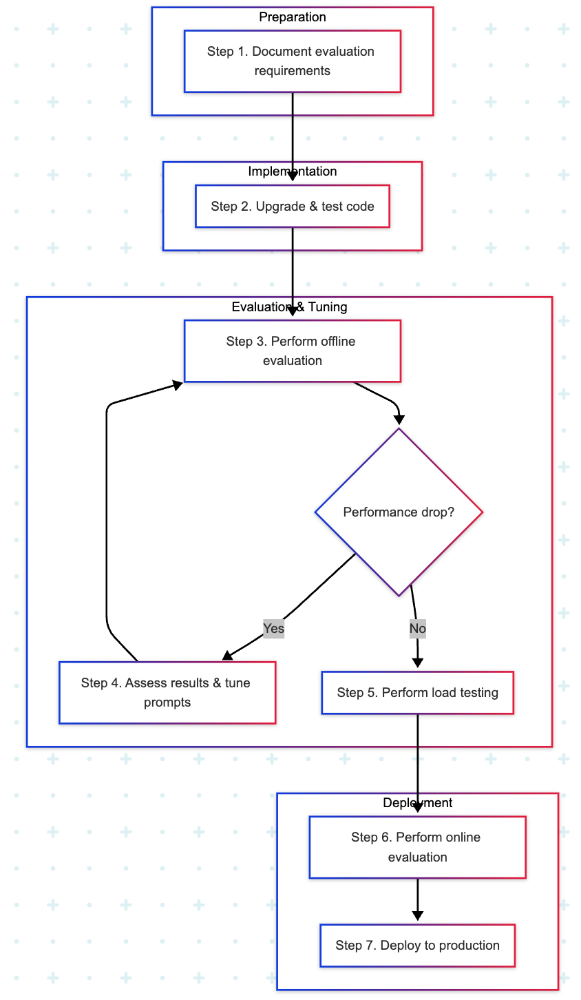

# Migrate your application to Gemini 2 with the Vertex AI Gemini API

This guide shows how to migrate generative AI applications from Gemini 1.x and PaLM models to [Gemini 2 models](/vertex-ai/generative-ai/docs/gemini-v2).

## 📚 Why migrate to Gemini 2?

Gemini 2 delivers significant performance improvements over Gemini 1.x and PaLM models, along with [new capabilities](/vertex-ai/generative-ai/docs/gemini-v2). Additionally, each model version has its own [version support and availability timeline](/vertex-ai/generative-ai/docs/learn/model-versions).

Upgrading most generative AI applications to Gemini 2 shouldn't require significant reengineering of prompts or code. But some applications require prompt changes, and these changes are difficult to predict without running a prompt through Gemini 2 first. Therefore, Gemini 2 testing is recommended before migration.

Significant code changes are only needed for certain breaking changes, or to use new Gemini 2 capabilities.

## 📚 Which Gemini 2 model should I migrate to?

As you choose a Gemini 2 model to migrate to, you'll want to consider the features that your application requires, as well as the [cost of those features](/vertex-ai/generative-ai/pricing).

For an overview of Gemini 2 model features, see [Gemini 2](/vertex-ai/generative-ai/docs/gemini-v2). For an overview of all Google models, see [Google models](/vertex-ai/generative-ai/docs/learn/models).

For a comparison of Gemini 1.x and Gemini 2 models, see the following table.

| Feature | Gemini 1.5 Pro | Gemini 1.5 Flash | Gemini 2.0 Flash | Gemini 2.0 Flash-Lite | Gemini 2.5 Pro | Gemini 2.5 Flash |
|---|---|---|---|---|---|---|
| Input modalities | text, documents, image, video, audio | text, documents, image, video, audio | text, documents, image, video, audio | text, documents, image, video, audio | text, documents, image, video, audio | text, documents, image, video, audio |
| Output modalities | text | text | text | text | text | text |
| Context window, total token limit | 2,097,152 | 1,048,576 | 1,048,576 | 1,048,576 | 1,048,576 | 1,048,576 |
| Output context length | 8,192 | 8,192 | 8,192 | 8,192 | 64,192 | 64,192 |
| [Grounding with Search](/vertex-ai/generative-ai/docs/grounding/grounding-with-google-search) | Yes | Yes | Yes | No | Yes | Yes |
| [Function calling](/vertex-ai/generative-ai/docs/multimodal/function-calling) | Yes | Yes | Yes | Yes | Yes | Yes |
| [Code execution](/vertex-ai/generative-ai/docs/multimodal/code-execution) | No | No | Yes | No | Yes | Yes |
| [Context caching](/vertex-ai/generative-ai/docs/context-cache/context-cache-overview) | Yes | Yes | Yes | No | Yes | Yes |
| [Batch prediction](/vertex-ai/generative-ai/docs/multimodal/batch-prediction-gemini) | Yes | Yes | Yes | Yes | Yes | Yes |
| [Live API](/vertex-ai/generative-ai/docs/live-api) | No | No | No | No | No | No |
| Latency | Most capable in 1.5 family | Fastest in 1.5 family | Fast + good cost efficiency | Fast + most cost efficient | Slower than Flash, but good cost efficiency | Fast + most cost efficient |
| [Fine-tuning](/vertex-ai/generative-ai/docs/models/tune-models) | Yes | Yes | Yes | Yes | Yes | Yes |
| Recommended SDK | [Vertex AI SDK](/vertex-ai/docs/python-sdk/use-vertex-ai-python-sdk) | [Vertex AI SDK](/vertex-ai/docs/python-sdk/use-vertex-ai-python-sdk) | [Gen AI SDK](/vertex-ai/generative-ai/docs/sdks/overview) | [Gen AI SDK](/vertex-ai/generative-ai/docs/sdks/overview) | [Gen AI SDK](/vertex-ai/generative-ai/docs/sdks/overview) | [Gen AI SDK](/vertex-ai/generative-ai/docs/sdks/overview) |
| [Pricing units](/vertex-ai/generative-ai/pricing) | Character | Character | Token | Token | Token | Token |

## ⚙️ Before you begin

For a seamless Gemini 2 migration, we recommend that you address the following concerns before you begin the migration process.

### Model retirement awareness
Note the [model version support and availability timelines](/vertex-ai/generative-ai/docs/learn/model-versions) for older Gemini models, and make sure your migration is completed before the model you're using is retired.

### InfoSec, governance, and regulatory approvals
Proactively request the approvals you need for Gemini 2 from your information security (InfoSec), risk, and compliance stakeholders. Make sure that you cover domain-specific risk and compliance constraints, especially in heavily regulated industries such as healthcare and financial services. Note that [Gemini security controls](/vertex-ai/generative-ai/docs/security-controls) differ among Gemini 2 models.

### Location availability
See the [Generative AI on Google Cloud models and partner model availability](/vertex-ai/generative-ai/docs/learn/locations#genai-locations) documentation, and make sure your chosen Gemini 2 model is available in the regions where you need it, or consider switching to the [global endpoint](/vertex-ai/generative-ai/docs/learn/locations#global-endpoint).

### Modality and tokenization-based pricing differences
Check Gemini 2 pricing for all the modalities (text, code, images, speech) in your application. For more information, see [generative AI pricing page](/vertex-ai/generative-ai/pricing). Note that Gemini 2 text input and output is priced per token, while Gemini 1 text input and output is priced per character.

### Provisioned Throughput
If needed, [purchase additional Provisioned Throughput](/vertex-ai/generative-ai/docs/purchase-provisioned-throughput#place-an-order) for Gemini 2 or [change existing Provisioned Throughput orders](/vertex-ai/generative-ai/docs/purchase-provisioned-throughput#change-order).

### Supervised fine-tuning
If your Gemini application uses [supervised fine-tuning](/vertex-ai/generative-ai/docs/models/gemini-supervised-tuning), submit a new tuning job with Gemini 2. We recommend that you start with the default tuning hyperparameters instead of reusing the hyperparameter values that you used with previous Gemini versions. The tuning service has been optimized for Gemini 2. Therefore, reusing previous hyperparameter values might not yield the best results.

### Regression testing
There are three main types of regression tests involved when upgrading to Gemini 2 models:
*   **Code regression tests**: Regression testing from a software engineering and DevOps perspective. This type of regression test is always required.
*   **Model performance regression tests**: Regression testing from a data science or machine learning perspective. This means ensuring that the new Gemini 2 model provides outputs that are at least as high-quality as outputs from the current production model. Model performance regression tests are just model evaluations done as part of a change to a system or to the underlying model. Model performance regression testing further breaks down into:
    *   **Offline model performance testing**: Assessing the quality of model outputs in a dedicated experimentation environment based on various model output quality metrics.
    *   **Online model performance testing**: Assessing the quality of model outputs in a live online deployment based on implicit or explicit user feedback.
*   **Load testing**: Assessing how the application handles high volumes of inference requests. This type of regression test is required for applications that require Provisioned Throughput.

## ⚙️ Migration process

The following diagram shows the high-level workflow for migrating your application to Gemini 2.

### Step 1: Document model evaluation and testing requirements
1.  Prepare to repeat any relevant evaluations from when you originally built your application, along with any relevant evaluations you have done since then.
2.  If you feel your existing evaluations don't appropriately cover or measure the breadth of tasks that your application performs, you should design and prepare additional evaluations.
3.  If your application involves RAG, tool use, complex agentic workflows, or prompt chains, make sure that your existing evaluation data allows for assessing each component independently. If not, gather input-output examples for each component.
4.  If your application is especially high-impact, or if it's part of a larger user-facing real-time system, you should include online evaluation.

### Step 2: Upgrade and test your code
If your Gemini 1.x application uses the Vertex AI SDK, consider upgrading to the Gen AI SDK. New Gemini 2 capabilities are only available in the Gen AI SDK. However, there is no need to switch to the Gen AI SDK if your application only requires capabilities that are available in the Vertex AI SDK.

If you're new to the Gen AI SDK, see the [Getting started with Google Generative AI using the Gen AI SDK](https://github.com/GoogleCloudPlatform/generative-ai/blob/main/gemini/getting-started/intro_genai_sdk.ipynb) notebook.

=== "Gen AI SDK"

    iii

=== "Vertex AI SDK"

    kkk

#### Change your Gemini calls
Change your prediction code to use Gemini 2. At a minimum, this means changing the specific model endpoint name to a Gemini 2 model where you load your model. The exact code change will differ depending on how you originally implemented your application, and especially whether you used the Gen AI SDK or the Vertex AI SDK.

After you make your code changes, perform code regression testing and other software tests on your code to make sure that it runs. This test is only meant to assess whether the code functions correctly. It's not meant to assess the quality of model responses.

#### Address breaking code changes
Focus only on code changes in this step. You may need to make other changes, but wait until you start your evaluation, and then consider the following adjustment based on evaluation results:

*   **Dynamic retrieval**: Switch to using [Grounding with Google Search](/vertex-ai/generative-ai/docs/grounding/grounding-with-google-search#dynamic-retrieval). This feature requires using the [Gen AI SDK](/vertex-ai/generative-ai/docs/sdks/overview); it's not supported by the Vertex AI SDK. If you're switching from dynamic retrieval, you might need to experiment with system instructions to control when Google Search is used (for example, `"Only generate queries for the Google Search tool if the user asks about sports. Don't generate queries for any other topic."`), but wait until you evaluate before making prompt changes.
*   **Content filters**: Note the [default content filter settings](/vertex-ai/generative-ai/docs/multimodal/configure-safety-filters#how_to_configure_content_filters), and change your code if it relies on a default that has changed.
*   **`Top-K` token sampling parameter**: Models after `gemini-1.0-pro-vision` don't support changing the [`Top-K` parameter](/vertex-ai/generative-ai/docs/multimodal/content-generation-parameters#top-k). If you used the `Top-K` parameter, adjust other token sampling parameters, such as [`Top-P`](/vertex-ai/generative-ai/docs/multimodal/content-generation-parameters#top-p), to achieve similar results.

### Step 3: Perform offline evaluation
Repeat the evaluation that you did when you originally developed and launched your application, any further offline evaluation you did after launching, and any additional evaluation you identified in step 1. If you then feel that your evaluation doesn't fully capture the breadth and depth of your application, do further evaluation.

If you don't have an automated way to run your offline evaluations, consider using the [Gen AI evaluation service](/vertex-ai/generative-ai/docs/models/evaluation-overview).

If your application uses fine-tuning, perform offline evaluation before retuning your model with Gemini 2. Gemini 2's improved output quality may mean that your application no longer requires a fine-tuned model.

### Step 4: Assess evaluation results and tune the Gemini 2 prompts and hyperparameters
If your offline evaluation shows a drop in performance with Gemini 2, iterate on your application as follows until Gemini performance matches the older model:

*   Iteratively engineer your prompts to improve performance ("Hill Climbing"). If you are new to hill climbing, see the [Vertex Gemini hill climbing online training](https://cloudonair.withgoogle.com/events/vertex-gemini-hill-climbing-your-way-to-optimal-prompts). The [Vertex AI prompt optimizer](/vertex-ai/generative-ai/docs/learn/prompts/prompt-optimizer) ([example notebook](https://github.com/GoogleCloudPlatform/generative-ai/blob/main/gemini/prompts/prompt_optimizer/vertex_ai_prompt_optimizer_sdk_custom_metric.ipynb)) can help as well.
*   If your application already relies on fine-tuning, try fine-tuning Gemini 2.
*   If your application is impacted by Dynamic Retrieval and Top-K breaking changes, experiment with changing your prompt and token sampling parameters.

### Step 5: Perform load testing
If your application requires a certain minimum throughput, perform load testing to make sure the Gemini 2 version of your application meets your throughput requirements.

Load testing should happen before online evaluation, because online evaluation requires exposing Gemini 2 to production traffic. Use your existing load testing instrumentation to perform this step.

If your application already meets throughput requirements, consider using [Provisioned Throughput](/vertex-ai/generative-ai/docs/provisioned-throughput). You'll need additional short-term Provisioned Throughput to cover load testing while your existing Provisioned Throughput order continues to serve production traffic.

### Step 6: Perform online evaluation
Only proceed to online evaluation if your offline evaluation shows adequate Gemini output quality _and_ your application requires online evaluation.

Online evaluation is a special case of online testing. Try to use your organization's existing tools and procedures for online evaluation. For example:

*   If your organization regularly conducts [A/B tests](https://en.wikipedia.org/wiki/A%2FB_testing), perform an A/B test that evaluates the current implementation of your application compared to the Gemini 2 version.
*   If your organization regularly conducts [canary deployments](https://en.wikipedia.org/wiki/Feature_toggle#Canary_release), be sure to do so with Gemini 2 and measure differences in user behavior.

Online evaluation can also be done by building new feedback and measurement capabilities into your application. Different feedback and measurement capabilities are appropriate for different applications. For example:

*   Adding thumbs-up and thumbs-down buttons next to model outputs and comparing thumbs-up versus thumbs-down rates between an older model and Gemini 2.
*   Presenting users with the older model and Gemini 2 outputs side-by-side and asking for users to pick their favorite.
*   Tracking how often users override or manually adjust older model versus Gemini 2 outputs.

These kinds of feedback mechanisms often require running a Gemini 2 version of your application in parallel to your existing version. This parallel deployment is sometimes called "shadow mode" or "blue-green deployment".

If online evaluation results differ significantly from offline evaluation results, your offline evaluation is not capturing key aspects of the live environment or user experience. Use the online evaluation findings to devise a new offline evaluation to cover the gap the online evaluation exposed, and then return to step 3.

If you use Provisioned Throughput, you may need to [purchase additional short-term Provisioned Throughput](/vertex-ai/generative-ai/docs/purchase-provisioned-throughput#pt-weekly-term) to continue to meet your throughput requirements for users subject to online evaluation.

### Step 7: Deploy to production
Once your evaluation shows that Gemini 2 meets or exceeds performance of an older model, turn down the existing version of your application in favor of the Gemini 2 version. Follow your organization's existing procedures for production rollout.

If you're using Provisioned Throughput, change your Provisioned Throughput order to your chosen Gemini 2 model. If you're rolling out your application incrementally, use short-term Provisioned Throughput to meet throughput requirements for two different Gemini models.

## 📚 Improving model performance

As you complete your migration, use the following tips to maximize Gemini 2 model performance:

*   Inspect your [system instructions](/vertex-ai/generative-ai/docs/learn/prompts/system-instructions), [prompts](/vertex-ai/generative-ai/docs/learn/prompts/prompt-design-strategies), and [few-shot learning examples](/vertex-ai/generative-ai/docs/learn/prompts/few-shot-examples) for any inconsistencies, contradictions, or irrelevant instructions and examples.
*   Test a more powerful model. For example, if you evaluated Gemini 2.0 Flash-Lite, try Gemini 2.0 Flash.
*   Examine any automated evaluation results to make sure they match human judgment, especially results that use a [judge model](/vertex-ai/generative-ai/docs/models/evaluate-judge-model). Make sure your judge model instructions don't contain inconsistencies or ambiguities.
*   One way to improve judge model instructions is to test the instructions with multiple humans in isolation and see if their judgments are consistent. If humans interpret the instructions differently and render different judgments, your judge model instructions are ambiguous.
*   [Fine-tune the Gemini 2 model](/vertex-ai/generative-ai/docs/models/tune-models).
*   Examine evaluation outputs to look for patterns that show specific kinds of failures. Grouping together failures into different models, kinds, or categories gives you more targeted evaluation data, which makes it easier to adjust prompts to address these errors.
*   Make sure you are independently evaluating different generative AI components.
*   Experiment with adjusting [token sampling parameters](/vertex-ai/generative-ai/docs/multimodal/content-generation-parameters#token-sampling-parameters).

## 🔗 Getting help

If you need help, Google Cloud offers support packages to meet your needs, such as 24/7 coverage, phone support, and access to a technical support manager. For more information, see [Google Cloud Support](/support).

## 🔗 What's next

*   Read the list of [frequently asked questions](/vertex-ai/generative-ai/docs/faq).
*   [Migrate from the PaLM API to the Vertex AI Gemini API](/vertex-ai/generative-ai/docs/migrate/migrate-palm-to-gemini).
